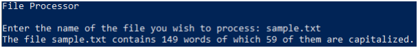

# File Processing

### Instructions:
 

- Design a Python program that prompts the user for the name of a file.  The program should open the file and calculate the total number of words in the document and the total number of capitalized words in the document.  If the file does not exist a user friendly error message should be displayed.
  - The file used to generate the sample output (sample.txt) is included in the repo, but you should test on other text files too.
  - You may treat any data separated from other data by whitespace as a word. 
  - Any string data that starts with a capital letter can be treated as a capitalized word.
  - Example: This sentence contains - 10 words, 1 which is capitalized. 
- Enter your name, the lab number, and the current date into a set of comments at the top of the code.	
- Push the program source code to the assignment repo. 

### Example Output

### Grading:
- General, compiles, comments, proper indentation, etc  
- Input  
- Error Handling  
- Word Count  
- Capitalized Word Count  
